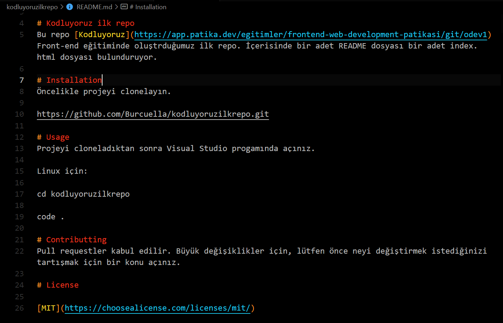

# Kodluyoruz ilk repo
Bu repo [Kodluyoruz](https://app.patika.dev/egitimler/frontend-web-development-patikasi/git/odev1) Front-end eğitiminde oluştrduğumuz ilk repo. İçerisinde bir adet README dosyası bir adet index.html dosyası bulunduruyor.

# Installation
Öncelikle projeyi clonelayın.

https://github.com/Burcuella/kodluyoruzilkrepo.git

# Usage
Projeyi cloneladıktan sonra Visual Studio Code progamında açınız.

Linux için:

cd kodluyoruzilkrepo

code .

# Contributting
Pull requestler kabul edilir. Büyük değişiklikler için, lütfen önce neyi değiştirmek istediğinizi tartışmak için bir konu açınız.

# License

[MIT](https://choosealicense.com/licenses/mit/)